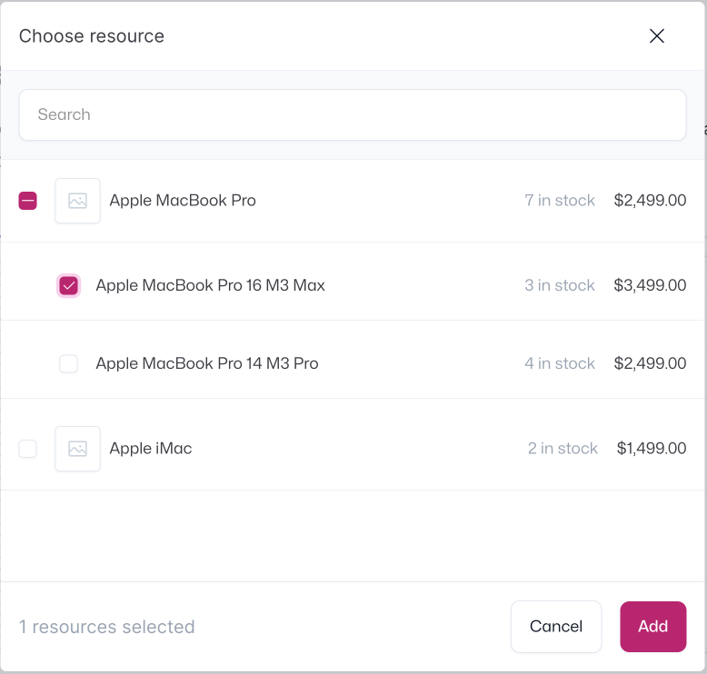
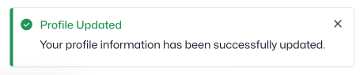

# YouCan Qantra

YouCan Qantra is a TypeScript library that helps you embed your application inside of the YouCan Seller Area. The following documentation will guide you through the initial setup process.

> [!Note]
> Qantra components do not render within the app's component hierarchy; instead, they encapsulate TypeScript messages responsible for communication with the Seller Area. The UI rendering is handled by the Seller Area.

## YouCan UI

When working on your app, it's a good idea to use YouCan UI. This helps ensure a consistent look and feel between your app and the Seller Area. Just import the YouCan UI Vue library into your app – it has all the components designed for the Seller Area. Check out the [documentation](https://developer.youcan.shop/youcan-ui/) to learn more about how to use the UI library.

## Reference

### Session Token

The Session Token API asynchronously retrieves your app's authentication token.

#### Example

```ts
const token = await qantra.sessionToken();
```

### Redirection

The redirection API allows you navigate within your app.

#### Parameters

- `(url: string) => void`

#### Example

```ts
qantra.redirect('/export');
```

### Bounce

The bounce API allows you navigate within the seller area's pages.

#### Parameters

- `(url: string) => void`

#### Example

```ts
qantra.bounce('/admin/customers');
```

### ResourcePicker

The Resource Picker API provides a search-based interface to help users find and select one or more products (with variants) or collections, and then returns the selected resources to your app.

#### Options

- **`type`**: `product` | `collection`

#### Example

```ts
const selected = await qantra.resourcePicker({ type: 'product' });
```



### Toast

The Toast API displays a non-disruptive message that appears in one of the four edges of the screen of the interface to provide quick and short feedback on the outcome of an action

#### Show method

The `toast.show` method is used to show a notification (Toast) in the Seller Area. You can customize its behavior by providing different options.

```ts
qantra.toast.show({
  title: 'This is a toast 🍞',
  description: 'Settings saved successfully',
});
```

#### ToastOptions

- **`title`**: `string`
- **`description`**: `string`
- **`position`**: `top-left` | `top-right` | `bottom-left` | `bottom-right`
- **`type`**: `info` | `success` | `warning` | `error`
- **`canClose`**: `boolean`
- **`closeAfterDuration`**: `number`

#### Example

```ts
qantra.toast.show({
  title: 'Settings saved',
  description: 'User settings have been saved successfully',
  position: 'bottom-left',
  type: 'success',
  canClose: false,
  closeAfterDuration: 2000,
});
```



---

For bug reports and feature requests, please open an issue in this repo.


